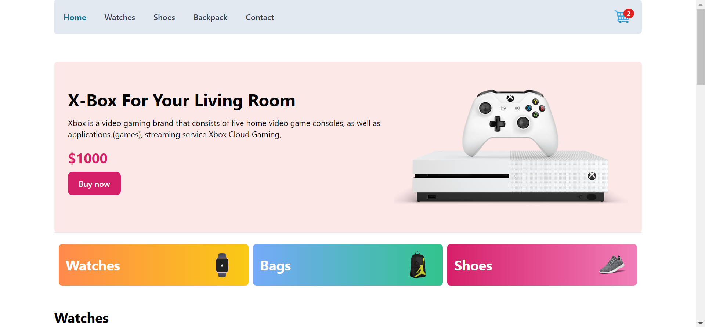

# E-commerce App

### A simple e-commerce app with minimalist and responsive Ui with react. Redux for global state management.
<br></br>
<kbd>[](https://e-commerce-redux-abidta.vercel.app/)<kbd>
## Features
- Global state management(Redux toolkit)
- Responsive design with Tailwind css

Link to [deployment](https://e-commerce-redux-abidta.vercel.app/)

## Development

### Setup

1. Clone the repo

   ```sh
   git clone https://github.com/abidta/e-commerce-redux.git
   ```
2. Go to the project folder

   ```sh
   cd e-commerce-redux
   ```
3. Install packages with npm, yarn or pnpm

   ```sh
   npm install
   ```
4. Start the server. In a development environment, just do:

   ```sh
   npm run dev
   ```

**Happy Coding!!! ❤️**
