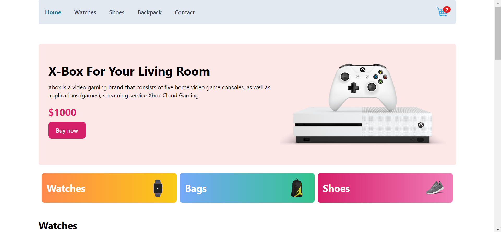

# E-commerce App

### Welcome to the E-Commerce App! This project is built with GraphQL, TypeScript, Express, Mongoose, React, URQL, Redux Toolkit, and Tailwind CSS.
<br></br>
<kbd>[](https://e-commerce-redux-abidta.vercel.app/)<kbd>
## Features

- **GraphQL API**:  Utilizing the power of GraphQL for flexible and efficient data querying.
- **MongoDB Database**:  MongoDB with Mongoose for a scalable and schema-based data storage.
- **Express Backend Server**:  A robust backend server built with Express for handling API requests.
- **React Frontend**:  A dynamic and responsive React frontend for an engaging user experience.
- **URQL for GraphQL**:  Efficient GraphQL client for querying and mutating data on the frontend.
- **Redux Toolkit**:  State management with Redux Toolkit for predictable and scalable state logic.
- **Tailwind CSS**:  Styling the UI with Tailwind CSS for a modern and clean look.
- **Pagination**:  Pagination and filtering for products.
- **Responsive Design**:  Ensuring a great user experience across various devices.


Link to [deployment](https://e-commerce-redux-abidta.vercel.app/)

## Development

### Setup

1. Clone the repo

   ```sh
   git clone https://github.com/abidta/e-commerce-redux.git
   ```
2. Go to the project folder

   ```sh
   cd e-commerce-redux
   ```
3. Install packages with npm, yarn or pnpm

   ```sh
   npm install
   ```
4. Start the server. In a development environment, just do:

   ```sh
   npm run dev
   ```

**Happy Coding!!! ❤️**
